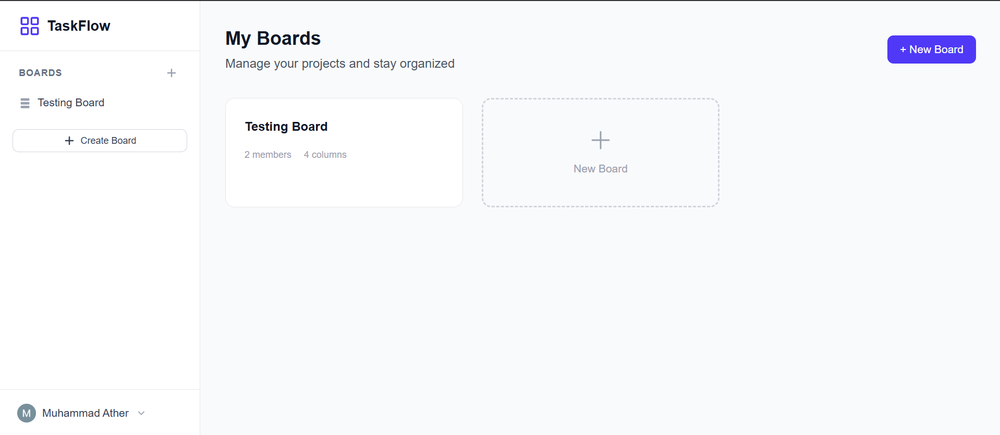
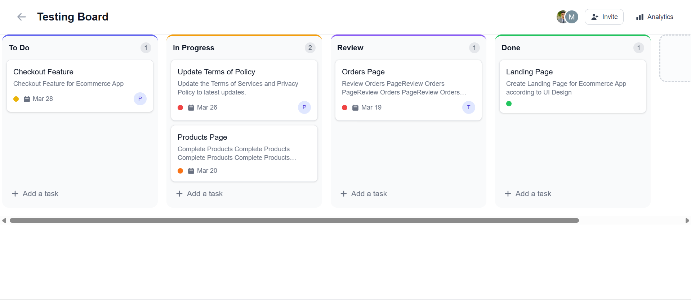
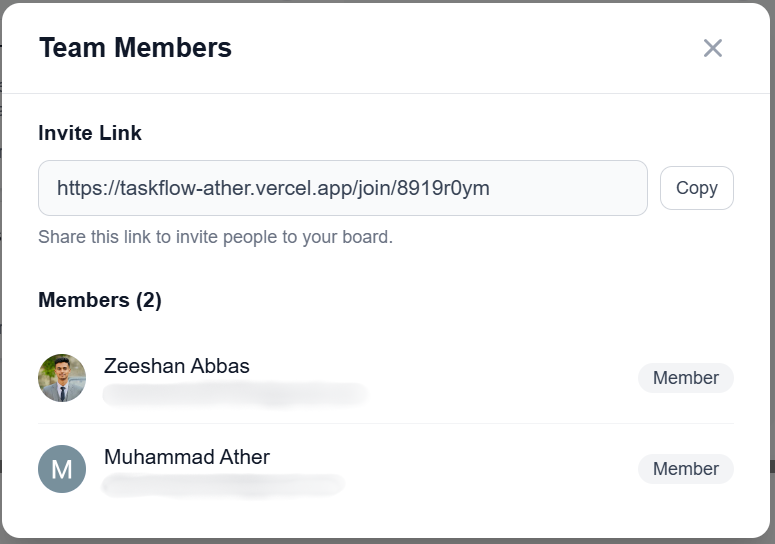
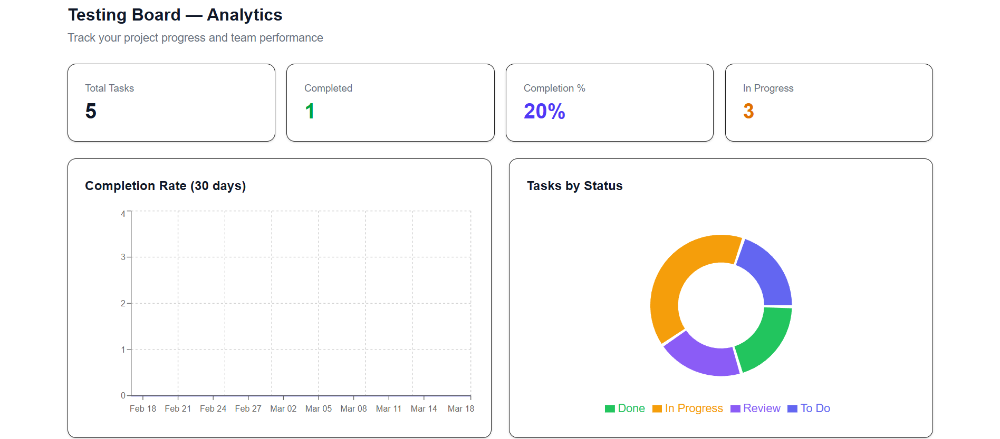

# TaskFlow

A real-time collaborative project management application built with Next.js and Firebase. TaskFlow enables teams to manage tasks on Kanban boards with live cursor tracking, real-time collaborative editing, and instant updates across all connected users.

## Screenshots

### Dashboard


### Kanban Board with Real-time Cursors


### Real-Time Collaboration with Team Members


### Analytics Dashboard


## Features

- **Real-time Collaboration** - See other team members' cursors moving on the board in real-time
- **Live Collaborative Editing** - Edit task titles and descriptions together with character-by-character sync (Google Docs-style)
- **Kanban Board** - Drag-and-drop task management with customizable columns
- **Team Management** - Invite members via shareable links, assign roles (Owner, Admin, Member, Viewer)
- **Task Management** - Create, edit, delete tasks with priorities, due dates, labels, and assignees
- **Activity Feed** - Real-time activity tracking and commenting on tasks
- **Analytics Dashboard** - Visual insights with charts for task completion rates, team performance, and more
- **Google Authentication** - Secure sign-in with Google accounts

## Tech Stack

- **Frontend**: Next.js 16, React 19, TypeScript
- **Styling**: Tailwind CSS
- **Backend/Database**: Firebase (Firestore, Realtime Database, Authentication)
- **Real-time Sync**: Yjs (CRDT-based collaborative editing)
- **Drag & Drop**: @dnd-kit
- **Charts**: Recharts
- **Date Handling**: date-fns

## Getting Started

### Prerequisites

- Node.js 18+
- npm or yarn
- Firebase project with Firestore, Realtime Database, and Authentication enabled

### Installation

1. Clone the repository:
```bash
git clone https://github.com/yourusername/task-flow.git
cd task-flow
```

2. Install dependencies:
```bash
npm install
```

3. Create a `.env.local` file with your Firebase configuration:
```env
NEXT_PUBLIC_FIREBASE_API_KEY=your_api_key
NEXT_PUBLIC_FIREBASE_AUTH_DOMAIN=your_project.firebaseapp.com
NEXT_PUBLIC_FIREBASE_PROJECT_ID=your_project_id
NEXT_PUBLIC_FIREBASE_STORAGE_BUCKET=your_project.appspot.com
NEXT_PUBLIC_FIREBASE_MESSAGING_SENDER_ID=your_sender_id
NEXT_PUBLIC_FIREBASE_APP_ID=your_app_id
NEXT_PUBLIC_FIREBASE_DATABASE_URL=https://your_project.firebaseio.com
```

4. Run the development server:
```bash
npm run dev
```

5. Open [http://localhost:3000](http://localhost:3000) in your browser.

## Project Structure

```
src/
├── app/                    # Next.js App Router pages
│   ├── (auth)/login/       # Authentication pages
│   ├── board/[boardId]/    # Kanban board page
│   ├── dashboard/          # User dashboard
│   └── analytics/          # Analytics page
├── components/
│   ├── board/              # Board, Column, TaskCard, TaskModal
│   ├── collaborative/      # Real-time editing components
│   ├── analytics/          # Chart components
│   ├── auth/               # Login, UserMenu
│   ├── layout/             # Header, Sidebar
│   └── ui/                 # Reusable UI components
├── hooks/                  # Custom React hooks
├── lib/                    # Firebase config, utilities, Yjs provider
├── contexts/               # React contexts (Auth)
└── types/                  # TypeScript type definitions
```

## Key Features Implementation

### Real-time Cursor Tracking
Uses Firebase Realtime Database to broadcast cursor positions with throttling (20 updates/sec) and automatic cleanup on disconnect.

### Collaborative Editing
Implements Yjs CRDTs with a custom Firebase provider for conflict-free real-time text synchronization across multiple users.

### Drag and Drop
Uses @dnd-kit for accessible, performant drag-and-drop with optimistic updates and batch Firestore operations.

## Deployment

Deploy easily on Vercel:

[](https://vercel.com/new/clone?repository-url=https://github.com/yourusername/task-flow)

## License

MIT License - feel free to use this project for personal or commercial purposes.
